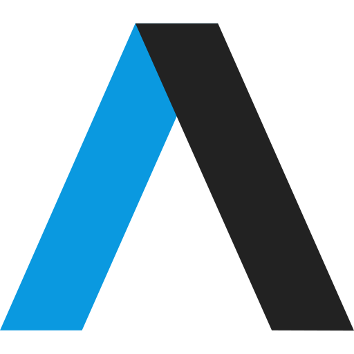

<h1>Projeto Univer Streamig</h1>

Uma reimaginação da experiência de streaming da plataforma Univer Videos

 

<h2>🎯 Por que estou construindo esse projeto</h2>

Sou um usuária frequente da plataforma Univer Videos e, como desenvolvedora, sempre noto pontos de melhoria na
    experiência do usuário, tanto no mobile quanto no desktop. Decidi usar essa oportunidade para estudar e aprimorar
    minhas habilidades no front-end, criando uma versão melhorada da interface..

 
<h2>Techs</h2>

    

        
        
NextJS

    

    

        
        
TypeScript

    

    

        
        
Shadcn

    

    

        
        
Tailwind

    

    

        
        
Axios

    

    

        
        
Tanstack

    

 
<h2>🛠️ Por que estou usando essas techs</h2>

    No meu trabalho atual, desenvolvo uma plataforma de cursos para áreas de CS e CX usando Next.js 12. Recentemente,
    nossa equipe recebeu uma demanda para criar um sistema de analytics, e aproveitei para apresentar uma POC com
    tecnologias mais atualizadas.

<h3>Meu objetivo com este projeto é:</h3>
<ul>
    <li>Dominar as funcionalidades do Next.js 15</li>
    <li>Explorar o ecossistema do Shadcn/ui</li>
    <li>Praticar padrões modernos de desenvolvimento React</li>
    <li>Aplicar conceitos de UX/UI em um projeto real</li>
</ul>
 

Este é um projeto de estudos e não tem fins comerciais.
